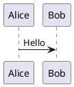

# PlantUML Graphs

Use PlantUML text files as source of truth, then render with the CLI. Prefer the bundled script for deterministic and repeatable `.puml -> .png` conversion.

## Workflow
1. Confirm diagram type and scope (sequence, class, component, activity, state, etc.).
2. Create or update a `.puml` file with `@startuml` and `@enduml`.
3. Run syntax check before rendering.
4. Render to PNG.
5. Confirm output file path(s) and report what was generated.

## Skill path (set once)
```bash
export CODEX_HOME="${CODEX_HOME:-$HOME/.codex}"
export PLANTUML_RENDER="$CODEX_HOME/skills/plantuml-graphs/scripts/render_plantuml.sh"
```

## Quick start
Render one file:
```bash
bash "$PLANTUML_RENDER" path/to/diagram.puml
```

Render all diagrams in a directory to one output folder:
```bash
bash "$PLANTUML_RENDER" path/to/diagrams --out-dir path/to/png
```

Syntax-only check:
```bash
bash "$PLANTUML_RENDER" path/to/diagram.puml --check-only
```

## Direct CLI fallback
```bash
plantuml -checkonly path/to/diagram.puml
plantuml -tpng path/to/diagram.puml
plantuml -tpng -output path/to/png path/to/diagrams/*.puml
```

## Minimal template


## Dependencies
- `plantuml` CLI
- `dot` from Graphviz

Install on macOS if needed:
```bash
brew install plantuml graphviz
```
