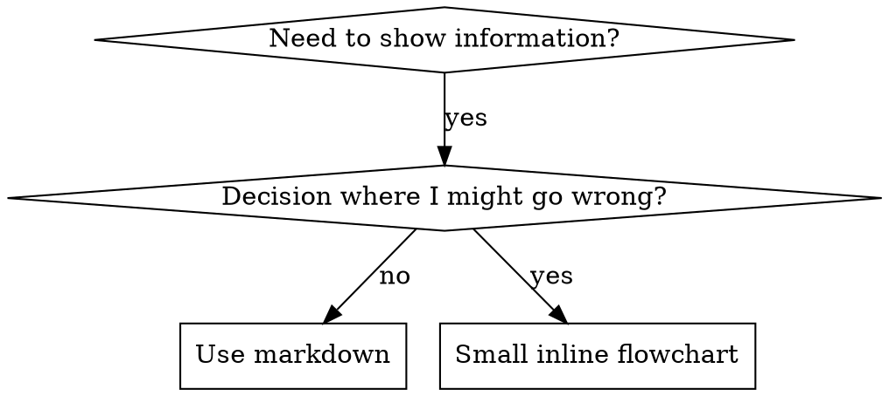

# Writing Skills

## Language Density Contract (Mandatory)

- Preserve full behavior/instruction set; compress wording, not scope.
- Default style: terse bullets, short clauses, noun-phrase acceptable.
- Remove filler/intro/conclusion text and motivational prose.
- One bullet = one directive; merge duplicates aggressively.
- Keep examples minimal and disambiguation-focused.
- Prefer tables/checklists over long prose where possible.
- Preserve normative force (`must`, `never`, `before`, `required`).
- Final pass required: tighten phrasing, collapse repetition, cut non-essential tokens.

## Overview

**Skill locations:** `~/.codex/skills` (Codex), `~/.agents/skills/` (shared discovery).

Process: define reusable guidance, compress wording, structure for discovery, remove ambiguity.

**Core principle:** Skills are durable operating guides. Optimize for fast discovery, precise routing, and low-token execution.

**Official guidance:** See `anthropic-best-practices.md` for complementary authoring guidance.
**Compliance shaping:** When a skill must reliably change agent behavior, consult `persuasion-principles.md` to choose minimal ethical persuasion techniques for the skill text. Use it for skill authoring discipline, not end-user manipulation or reference-only docs.

## What is a Skill?

A **skill** is a reusable guide for proven techniques, patterns, or tools.

**Skills are:** Reusable techniques, patterns, tools, reference guides

**Skills are NOT:** Narratives about how you solved a problem once

## When to Create a Skill

Create when:
- Technique wasn't intuitively obvious to you
- You'd reference this again across projects
- Pattern applies broadly (not project-specific)
- Others would benefit

Do not create for:
- One-off solutions
- Standard practices well-documented elsewhere
- Project-specific conventions (put in AGENTS.md)
- Mechanical constraints (if it's enforceable with regex/validation, automate it—save documentation for judgment calls)

## Skill Types

### Technique
Concrete method with steps to follow (condition-based-waiting, root-cause-tracing)

### Pattern
Way of thinking about problems (flatten-with-flags, test-invariants)

### Reference
API docs, syntax guides, tool documentation (office docs)

## Directory Structure


```
skills/
  skill-name/
    SKILL.md              # Main reference (required)
    supporting-file.*     # Only if needed
```

**Flat namespace** - all skills in one searchable namespace

**Separate files for:**
1. **Heavy reference** (100+ lines) - API docs, comprehensive syntax
2. **Reusable tools** - Scripts, utilities, templates

**Keep inline:**
- Principles and concepts
- Code patterns (< 50 lines)
- Everything else

## SKILL.md Structure

**Frontmatter (YAML):**
- Only two fields supported: `name` and `description`
- Max 1024 characters total
- `name`: Use letters, numbers, and hyphens only (no parentheses, special chars); follow canonical naming rules in Section 3
- `description`: Third-person, describes ONLY when to use (NOT what it does)
  - Start with "Use when..." to focus on triggering conditions
  - Include specific symptoms, situations, and contexts
  - **NEVER summarize the skill's process or workflow** (see CSO section for why)
  - Keep under 500 characters if possible
- Body language: dense, directive, compression-first; avoid explanatory paragraphs except minimal overview context.

```markdown
---
name: Skill-Name-With-Hyphens
description: Use when [specific triggering conditions and symptoms]
---

# Skill Name

## Overview
What is this? Core principle in 1-2 sentences.

## When to Use
[Small inline flowchart IF decision non-obvious]

Bullet list with SYMPTOMS and use cases
When NOT to use

## Core Pattern (for techniques/patterns)
Before/after code comparison

## Quick Reference
Table or bullets for scanning common operations

## Implementation
Inline code for simple patterns
Link to file for heavy reference or reusable tools

## Common Mistakes
What goes wrong + fixes

## Real-World Impact (optional)
Concrete results
```


## Skill Search Optimization (SSO)

**Critical for discovery:** Future agents need to FIND your skill

### 1. Rich Description Field

**Purpose:** the agent reads description to decide which skills to load for a given task. Make it answer: "Should I read this skill right now?"

**Format:** Start with "Use when..." to focus on triggering conditions

**CRITICAL: Description = When to Use, NOT What the Skill Does**

The description should ONLY describe triggering conditions. Do NOT summarize the skill's process or workflow in the description.

**Why this matters:** Testing revealed that when a description summarizes the skill's workflow, the agent may follow the description instead of reading the full skill content. A description saying "code review between tasks" caused the agent to do ONE review, even though the skill's flowchart clearly showed TWO reviews (spec compliance then code quality).

When the description was changed to just "Use when executing implementation plans with independent tasks" (no workflow summary), the agent correctly read the flowchart and followed the two-stage review process.

**The trap:** Descriptions that summarize workflow create a shortcut the agent will take. The skill body becomes documentation the agent skips.

```yaml
# ❌ BAD: Summarizes workflow - the agent may follow this instead of reading skill
description: Use when executing plans - dispatches subagent per task with code review between tasks

# ❌ BAD: Too much process detail
description: Use when writing docs - explains naming rules, structure, and examples to include

# ✅ GOOD: Just triggering conditions, no workflow summary
description: Use when executing implementation plans with independent tasks in the current session

# ✅ GOOD: Triggering conditions only
description: Use when implementing any feature or bugfix, before writing implementation code
```

**Content:**
- Use concrete triggers, symptoms, and situations that signal this skill applies
- Describe the *problem* (race conditions, inconsistent behavior) not *language-specific symptoms* (setTimeout, sleep)
- Keep triggers technology-agnostic unless the skill itself is technology-specific
- If skill is technology-specific, make that explicit in the trigger
- Write in third person (injected into system prompt)
- **NEVER summarize the skill's process or workflow**

```yaml
# ❌ BAD: Too abstract, vague, doesn't include when to use
description: For React Router

# ❌ BAD: First person
description: I can help you with React Router redirects

# ❌ BAD: Mentions implementation details but skill isn't specific to them
description: Use when routes use redirects and loaders

# ✅ GOOD: Starts with "Use when", describes problem, no workflow
description: Use when navigation behavior is inconsistent, route guards are involved, or redirects need clear ownership

# ✅ GOOD: Technology-specific skill with explicit trigger
description: Use when using React Router and handling authentication redirects
```

### 2. Keyword Coverage

Use words the agent would search for:
- Error messages: "Hook timed out", "ENOTEMPTY", "race condition"
- Symptoms: "flaky", "hanging", "zombie", "pollution"
- Synonyms: "timeout/hang/freeze", "cleanup/teardown/afterEach"
- Tools: Actual commands, library names, file types

### 3. Canonical Skill Naming (Mandatory)

**Canonical format:**
- `kebab-case` only: letters, numbers, hyphens
- Pattern: `<namespace>-<topic>[-<qualifier>]`
- 2-5 segments preferred; avoid one-word generic names for new skills

**Namespace rules (mandatory for new/refactored skills):**
- UI/visual/motion/layout/interaction: `design-*`
- Writing/copy/editing/docs/notes: `writing-*`
- CRO/SEO/behavioral marketing: `marketing-*`
- Web framework/platform best practices: `web-*`
- Apple platform/API/runtime: `ios-*`

**Suffix semantics (use when applicable):**
- `*-diag`: diagnostic workflows
- `*-ref`: API/reference catalogs
- `*-migration`: migration guides
- `*-best-practices`: standards/pattern guidance

**Identity invariants (required):**
- Skill directory name MUST equal frontmatter `name`
- Cross references MUST use that exact canonical name
- No alias directories for renamed skills

**Examples (current taxonomy):**
- ✅ `design-interaction-motion-craft`
- ✅ `marketing-seo-audit`
- ✅ `web-next-best-practices`

### 4. Token Efficiency (Critical)

**Problem:** getting-started and frequently-referenced skills load into EVERY conversation. Every token counts.

**Policy:** Density/compression is mandatory for all new/edited skills, not optional guidance.

**Target word counts:**
- getting-started workflows: <150 words each
- Frequently-loaded skills: <200 words total
- Other skills: <500 words (still be concise)

**Techniques:**

**Move details to tool help:**
```bash
# ❌ BAD: Document all flags in SKILL.md
search-conversations supports --text, --both, --after DATE, --before DATE, --limit N

# ✅ GOOD: Reference --help
search-conversations supports multiple modes and filters. Run --help for details.
```

**Use cross-references:**
```markdown
# ❌ BAD: Repeat workflow details
When searching, dispatch subagent with template...
[20 lines of repeated instructions]

# ✅ GOOD: Reference other skill
Always use subagents (50-100x context savings). REQUIRED: Use [other-skill-name] for workflow.
```

**Compress examples:**
```markdown
# ❌ BAD: Verbose example (42 words)
your human partner: "How did we handle authentication errors in React Router before?"
You: I'll search past conversations for React Router authentication patterns.
[Dispatch subagent with search query: "React Router authentication error handling 401"]

# ✅ GOOD: Minimal example (20 words)
Partner: "How did we handle auth errors in React Router?"
You: Searching...
[Dispatch subagent → synthesis]
```

**Eliminate redundancy:**
- Don't repeat what's in cross-referenced skills
- Don't explain what's obvious from command
- Don't include multiple examples of same pattern
- Don't repeat equivalent constraints across sections

**Verification:**
```bash
wc -w skills/path/SKILL.md
# getting-started workflows: aim for <150 each
# Other frequently-loaded: aim for <200 total
rg -n "Welcome|This document explains|Remember to|You should" skills/path/SKILL.md
# Expect no filler phrasing matches
```

### 5. Persuasion Techniques For Skill Authoring

Use `persuasion-principles.md` when a skill is ignored, partially followed, or needs stronger compliance under pressure.

- Apply persuasion only to improve correct skill execution in the user's interest.
- Match intensity to skill type: discipline skills can use stronger authority/commitment; guidance skills should stay lighter.
- Prefer the minimum effective technique set; overuse makes skills noisy and manipulative.
- Do not use persuasion patterns for end-user copy, marketing output, or reference catalogs.
- Keep the main skill self-sufficient; the persuasion doc sharpens wording, not replaces core instructions.

**Name by what you DO or core insight:**
- ✅ `condition-based-waiting` > `async-helpers`
- ✅ `skill-routing` > `skill-usage`
- ✅ `flatten-with-flags` > `data-structure-refactoring`
- ✅ `root-cause-tracing` > `debugging-techniques`

**Gerunds (-ing) work well for processes:**
- `writing-docs`, `routing-by-intent`, `debugging-with-logs`
- Active, describes the action you're taking

### 6. Cross-Referencing Other Skills

**When writing documentation that references other skills:**

Use skill name only, with explicit requirement markers:
- ✅ Good: `**REQUIRED SKILL:** Use review-requesting-code-review`
- ✅ Good: `**REQUIRED BACKGROUND:** Understand the routing model before editing triggers`
- ❌ Bad: `See skills/some-old-skill-name` (stale/nonexistent skill reference)
- ❌ Bad: `@skills/some-old-skill-name/SKILL.md` (force-loads, burns context)

**Why no @ links:** `@` syntax force-loads files immediately, consuming 200k+ context before you need them.

## Flowchart Usage



**Use flowcharts ONLY for:**
- Non-obvious decision points
- Process loops where you might stop too early
- "When to use A vs B" decisions

**Never use flowcharts for:**
- Reference material → Tables, lists
- Code examples → Markdown blocks
- Linear instructions → Numbered lists
- Labels without semantic meaning (step1, helper2)

See @graphviz-conventions.dot for graphviz style rules.

**Visualizing for your human partner:** Use `render-graphs.js` in this directory to render a skill's flowcharts to SVG:
```bash
./render-graphs.js ../some-skill           # Each diagram separately
./render-graphs.js ../some-skill --combine # All diagrams in one SVG
```

## Code Examples

**One excellent example beats many mediocre ones**

Choose most relevant language:
- Web techniques → TypeScript/JavaScript
- System debugging → Shell/Python
- Data processing → Python

**Good example:**
- Complete and runnable
- Well-commented explaining WHY
- From real scenario
- Shows pattern clearly
- Ready to adapt (not generic template)

**Don't:**
- Implement in 5+ languages
- Create fill-in-the-blank templates
- Write contrived examples

You're good at porting - one great example is enough.

## File Organization

### Self-Contained Skill
```
defense-in-depth/
  SKILL.md    # Everything inline
```
When: All content fits, no heavy reference needed

### Skill with Reusable Tool
```
condition-based-waiting/
  SKILL.md    # Overview + patterns
  example.ts  # Working helpers to adapt
```
When: Tool is reusable code, not just narrative

### Skill with Heavy Reference
```
pptx/
  SKILL.md       # Overview + workflows
  pptxgenjs.md   # 600 lines API reference
  ooxml.md       # 500 lines XML structure
  scripts/       # Executable tools
```
When: Reference material too large for inline

## Anti-Patterns

### ❌ Narrative Example
"In session 2025-10-03, we found empty projectDir caused..."
**Why bad:** Too specific, not reusable

### ❌ Multi-Language Dilution
example-js.js, example-py.py, example-go.go
**Why bad:** Mediocre quality, maintenance burden

### ❌ Code in Flowcharts
```dot
step1 [label="import fs"];
step2 [label="read file"];
```
**Why bad:** Can't copy-paste, hard to read

### ❌ Generic Labels
helper1, helper2, step3, pattern4
**Why bad:** Labels should have semantic meaning

## Skill Creation Checklist

**IMPORTANT: Use TodoWrite to create todos for EACH checklist item below.**

- [ ] Name uses canonical `kebab-case` and namespace rules (`design|writing|marketing|web|ios` when applicable)
- [ ] Directory name == frontmatter `name` == canonical referenced name
- [ ] YAML frontmatter with only name and description (max 1024 chars)
- [ ] Description starts with "Use when..." and includes specific triggers/symptoms
- [ ] Description written in third person
- [ ] Keywords throughout for search (errors, symptoms, tools)
- [ ] Clear overview with core principle
- [ ] Address the concrete use case; avoid hypothetical expansion
- [ ] Code inline OR link to separate file
- [ ] One excellent example (not multi-language)
- [ ] Dense/compressed language applied across sections (no filler prose)
- [ ] No duplicated constraints across sections

**Quality Checks:**
- [ ] Small flowchart only if decision non-obvious
- [ ] Quick reference table
- [ ] Common mistakes section
- [ ] No narrative storytelling
- [ ] Supporting files only for tools or heavy reference
- [ ] Final density pass completed (tight phrasing, merged duplicates, token reduction)

**Deployment:**
- [ ] Commit skill to git and push to your fork (if configured)
- [ ] Consider contributing back via PR (if broadly useful)

## Discovery Workflow

How future agents find your skill:

1. **Encounters problem** ("routing behavior is inconsistent")
3. **Finds SKILL** (description matches)
4. **Scans overview** (is this relevant?)
5. **Reads patterns** (quick reference table)
6. **Loads example** (only when implementing)

**Optimize for this flow** - put searchable terms early and often.
